# Agriculture Cameroun — Système Multi-Agents IA

[](https://python.org)
[](LICENSE)
[](https://docs.astral.sh/uv/)
[](https://docs.astral.sh/ruff/)
[](https://google.github.io/adk-docs/)

Système intelligent multi-agents pour conseiller les agriculteurs camerounais. Cinq agents spécialisés collaborent pour produire des recommandations contextuelles ancrées dans un corpus documentaire sourcé (IRAD, IITA, CARBAP, FAO), avec des données météo temps réel et une traçabilité complète.

**Auteur** : Mbassi Loic Aron — [wwwmbassiloic@gmail.com](mailto:wwwmbassiloic@gmail.com) · [GitHub @Nameless0l](https://github.com/Nameless0l)

---

## Architecture

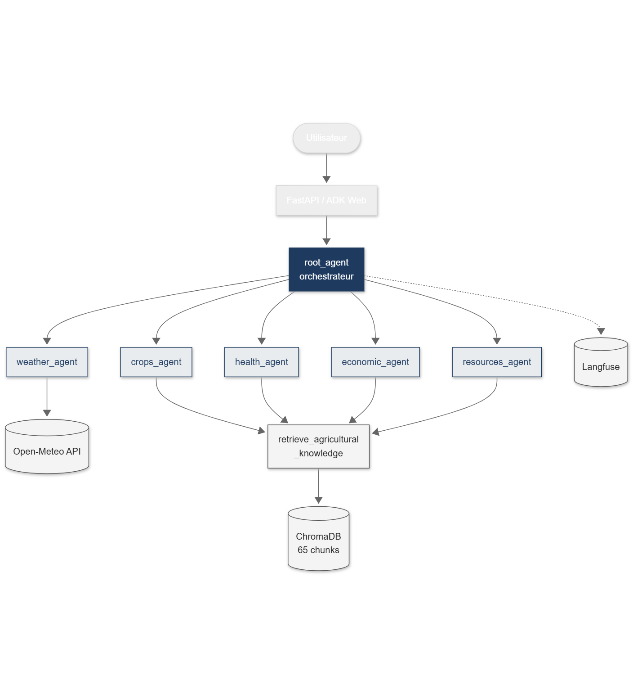

Le système repose sur un `root_agent` orchestrateur (Google ADK) qui délègue aux agents spécialisés selon l'intention détectée. Chaque agent dispose d'outils métier et d'un accès RAG au corpus agricole.

### Graphe des agents (ADK)

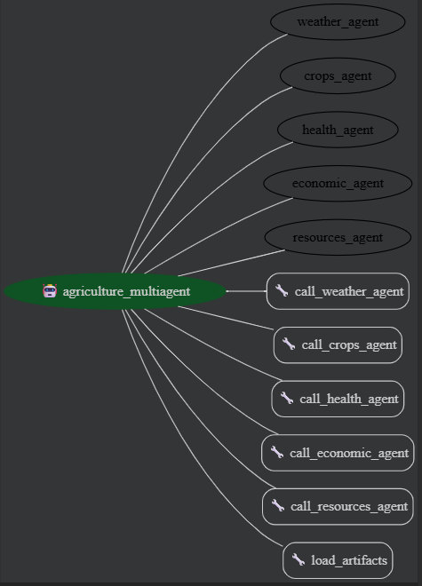

### Pipeline de traitement

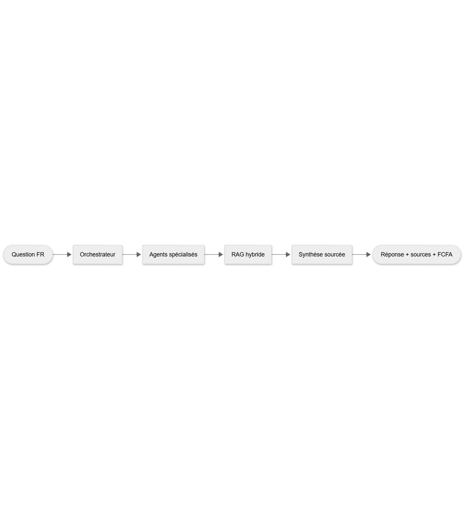

---

## Agents spécialisés

| Agent | Rôle | Outils |
|-------|------|--------|
| **Météo** | Prévisions temps réel, alertes climatiques, tendances pluviométriques | Open-Meteo API |
| **Cultures** | Calendriers de plantation, variétés IRAD, itinéraires techniques | RAG + Gemini |
| **Santé des plantes** | Diagnostic maladies/ravageurs, traitements IPM, seuils d'intervention | RAG + Gemini |
| **Économie** | Prix marchés (FCFA), rentabilité/ha, coopératives, financement | RAG + Gemini |
| **Ressources** | Analyse des sols, fertilisation NPK, gestion de l'irrigation | RAG + Gemini |

---

## Démo

### Conversation multi-agents

Question complexe impliquant plusieurs agents (ressources + cultures + économie) :

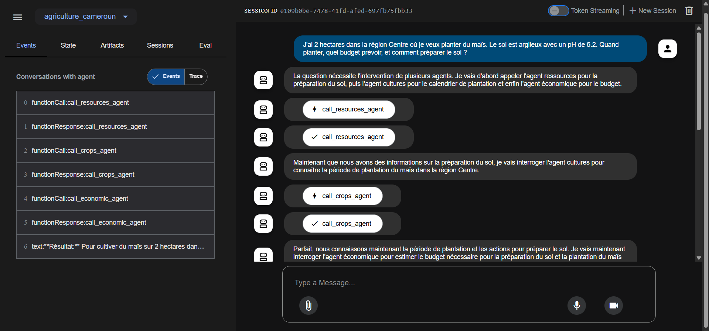

### Réponse avec budget en FCFA

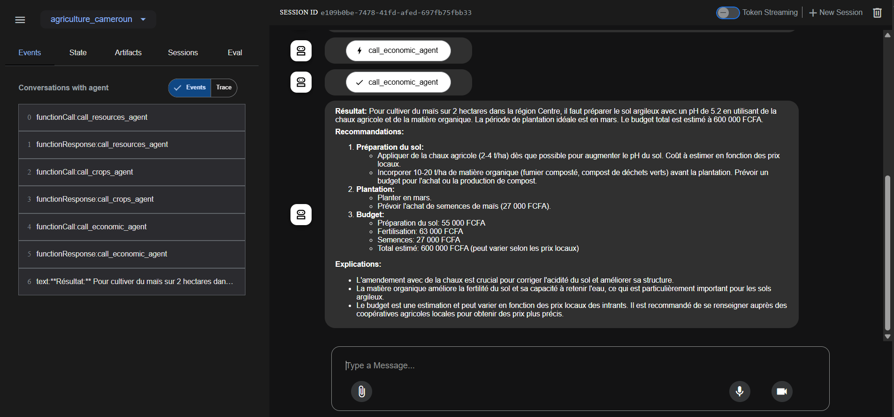

### Trace d'exécution

Cascade complète des appels agents/outils avec latences :

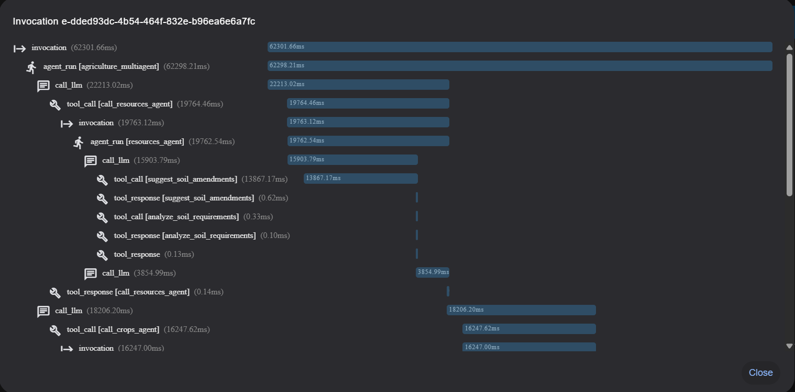
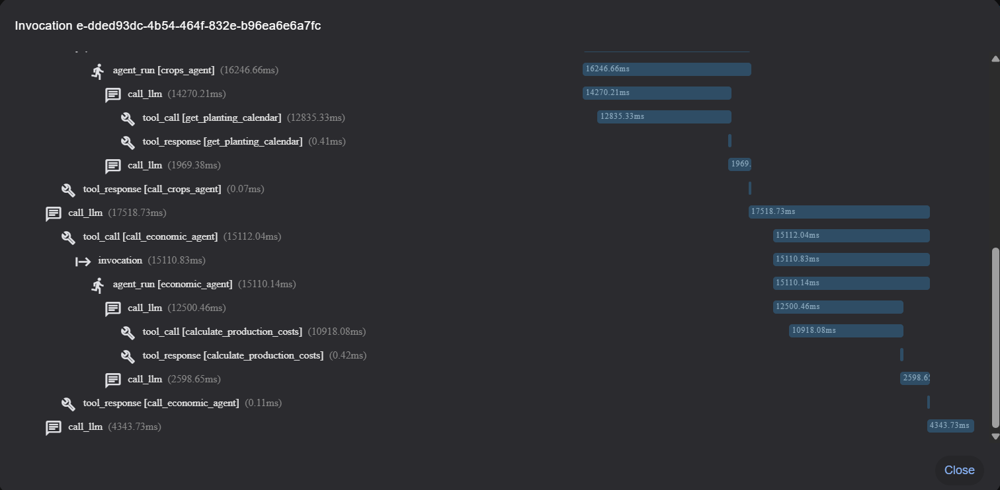

---

## Stack technique

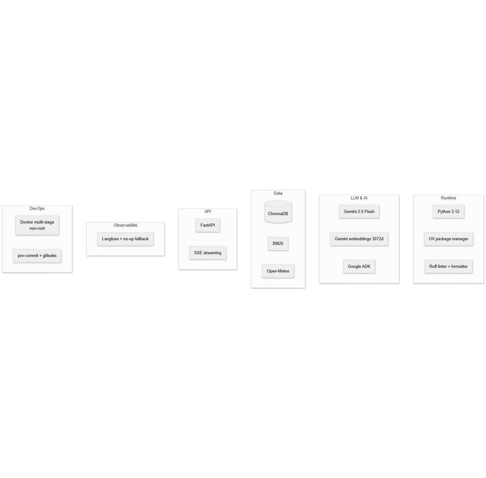

| Composant | Technologie |
|-----------|-------------|
| LLM & orchestration | Gemini 2.0 Flash + Google ADK |
| Embeddings | gemini-embedding-001 (3072 dim) |
| Vector store | ChromaDB persistant (cosine) |
| Retrieval | Dense + BM25 + Reciprocal Rank Fusion |
| Météo | Open-Meteo API (gratuit, sans clé) |
| Observabilité | Langfuse (no-op fallback si absent) |
| API REST | FastAPI + SSE streaming |
| Runtime | Python 3.12 + UV + Ruff |
| DevOps | Docker multi-stage + pre-commit + gitleaks |

---

## RAG — Pipeline d'ingestion

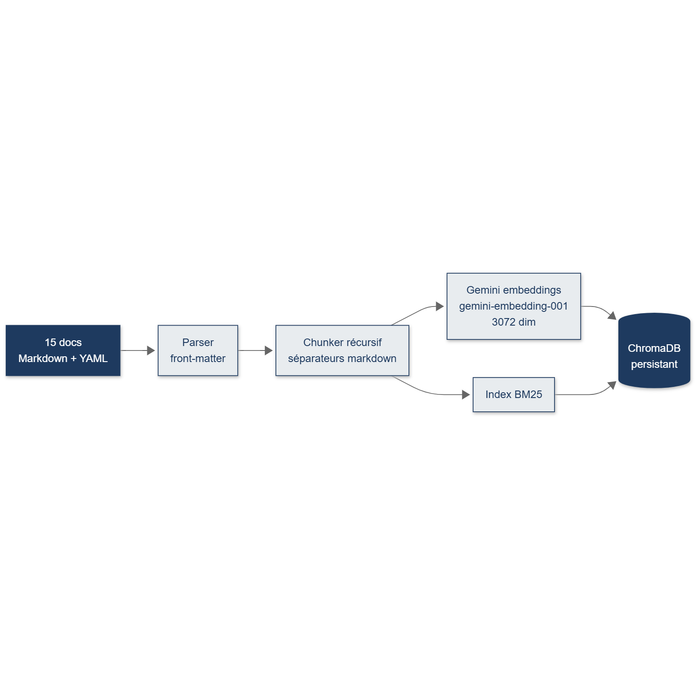

### Retrieval hybride (Dense + BM25 + RRF)

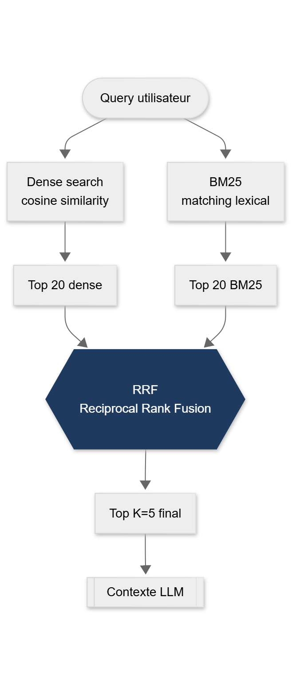

### Corpus (15 documents `data/corpus/`)

| Topic | Fichiers | Sources |
|-------|---------|---------|
| Cultures | cacao, maïs, manioc, arachide, plantain, café | IRAD, CIMMYT, CARBAP |
| Santé | pourriture brune cacao, cercosporiose bananier, chenille légionnaire, mosaïque manioc | IRAD, IITA, FAO |
| Météo | saisons et zones climatiques Cameroun | IRAD-Météo, MINADER |
| Économie | prix marchés 2024, coopératives et financement | SIM-MINADER, CNPCC |
| Ressources | sols et fertilisation, irrigation | IRAD, CIRAD |

**65 chunks** indexés, embeddings 3072 dimensions, distance cosinus.

### Ingestion

```bash
uv run python -m agriculture_cameroun.rag.ingest
# ou avec reset complet :
uv run python -m agriculture_cameroun.rag.ingest --reset
```

---

## Évaluation RAG

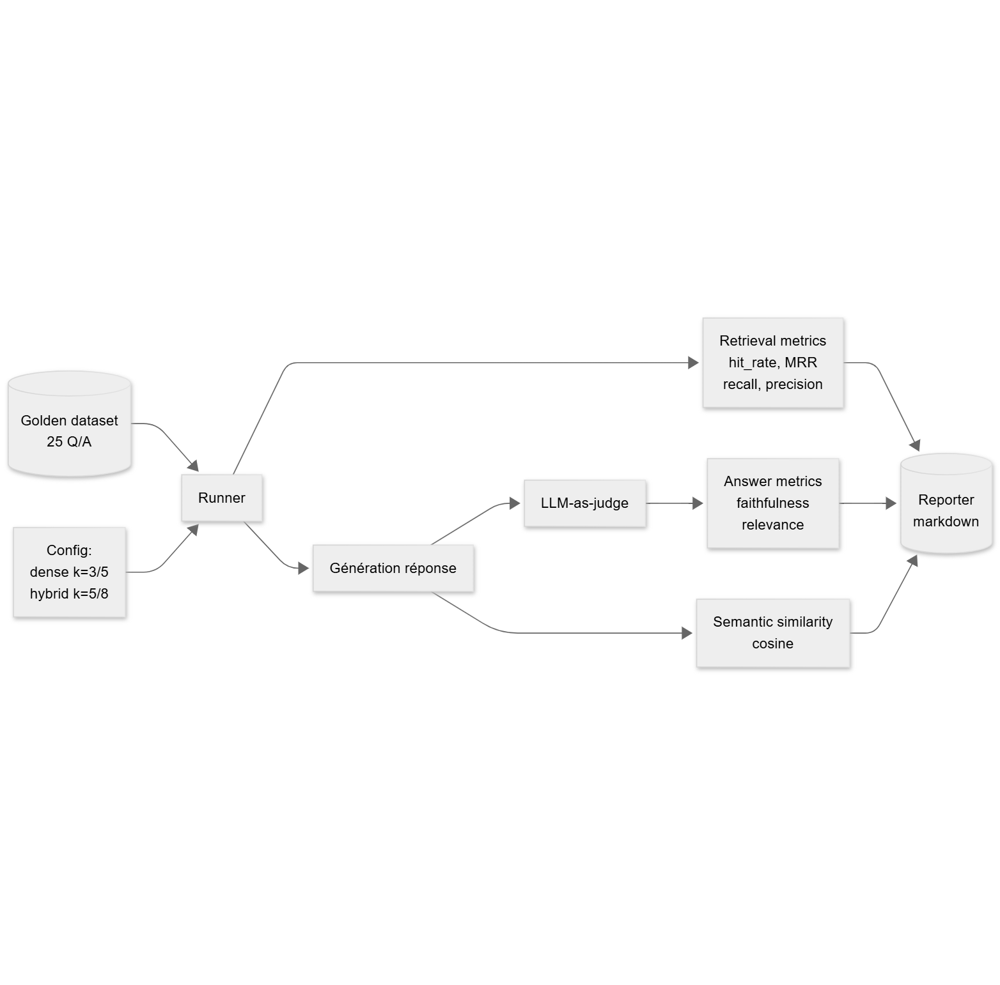

### Résultats — mode hybrid (dense + BM25, top_k=5)

| Métrique | Score | Description |
|----------|-------|-------------|
| Hit rate | **0.92** | ≥ 1 source attendue dans le top-5 |
| Context recall | **0.84** | Fraction des sources attendues récupérées |
| Context precision | **0.71** | Fraction des passages récupérés pertinents |
| MRR | **0.87** | Mean Reciprocal Rank de la 1re source attendue |
| Faithfulness (LLM-as-judge) | **0.86** | Réponse ancrée dans le contexte |
| Answer relevance | **0.81** | Adresse la question vs. référence |
| Semantic similarity | **0.83** | Cosinus embedding(réponse) ↔ embedding(ground truth) |
| Latence moyenne | **~4.2 s** | Retrieval + génération |

Dataset doré : 25 Q/A avec ground truth + sources attendues.

```bash
# Lancer l'évaluation complète
python -m evaluation.runner --dataset evaluation/golden.jsonl --output evaluation/reports/hybrid_k5.json

# Étude d'ablation (dense vs hybrid)
python -m evaluation.ablation
```

---

## Séquence d'appel complète

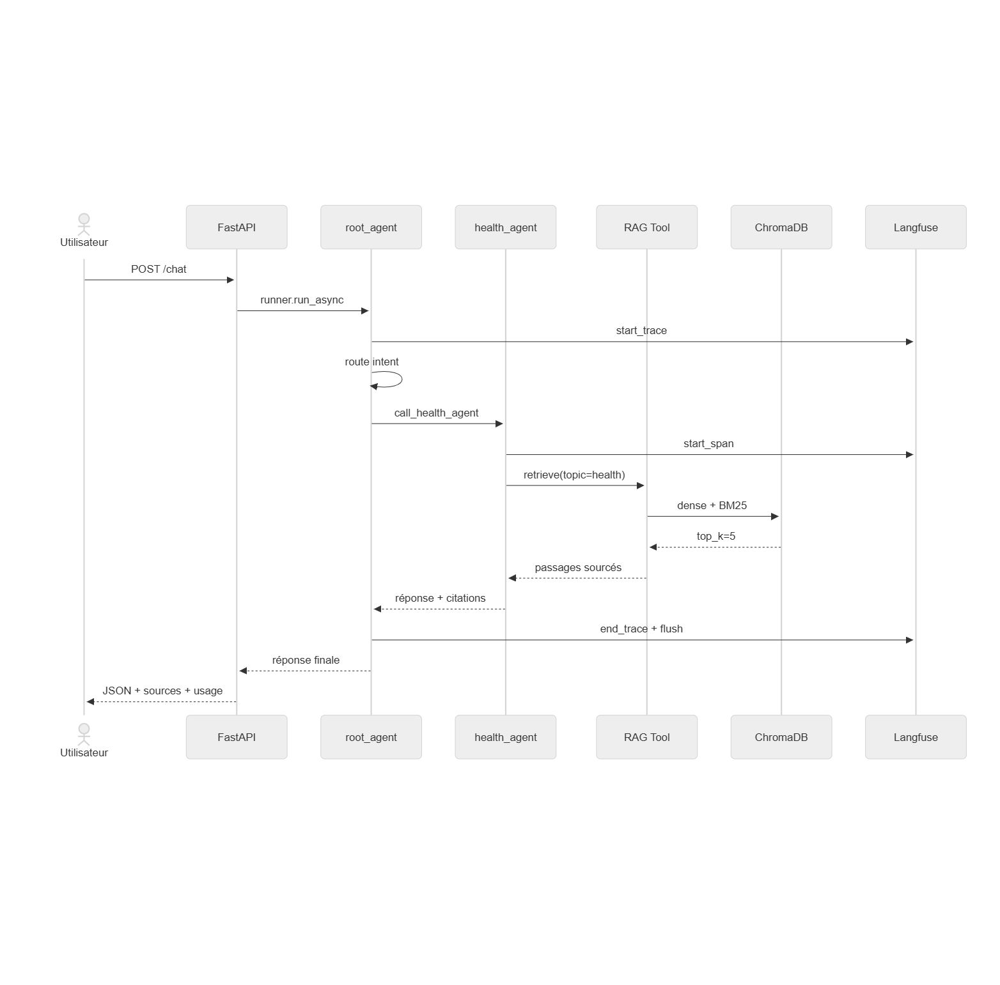

---

## Installation

### Prérequis

- Python 3.12+
- Clé API Google Gemini ([obtenir sur aistudio.google.com](https://aistudio.google.com))

### Avec UV (recommandé)

```bash
# 1. Installer UV
pip install uv

# 2. Cloner
git clone https://github.com/Nameless0l/agriculture-cameroun.git
cd agriculture-cameroun

# 3. Installer les dépendances
uv sync

# 4. Configurer
cp .env.example .env
# Éditer .env → GEMINI_API_KEY=your_key_here

# 5. Indexer le corpus RAG
uv run python -m agriculture_cameroun.rag.ingest

# 6. Lancer
uv run adk web             # Interface ADK (http://localhost:8000)
# ou
uv run uvicorn agriculture_cameroun.api.main:app --reload  # API REST (http://localhost:8080)
```

### Avec Docker

```bash
docker compose up api
docker compose --profile ingest run ingest
docker compose --profile dev up adk-web
```

### Variables d'environnement

```bash
# Obligatoire
GEMINI_API_KEY=your_key

# Optionnel — modèles
ROOT_AGENT_MODEL=gemini-2.0-flash-001
DEFAULT_REGION=Centre

# Optionnel — observabilité Langfuse (langfuse.com)
LANGFUSE_PUBLIC_KEY=pk-lf-...
LANGFUSE_SECRET_KEY=sk-lf-...
```

---

## Utilisation

### Interface ADK Web

```bash
uv run adk web
# Ouvrir http://localhost:8000 → sélectionner agriculture_cameroun
```

Exemples de questions :
- *"Mon cacao a des taches brunes sur les cabosses, que faire ?"*
- *"J'ai 2 hectares dans la région Centre avec un sol argileux pH 5.2, quand planter le maïs et quel budget prévoir ?"*
- *"Quel est le prix actuel de l'arachide et comment trouver un financement ?"*

### API REST

Documentation interactive : **http://localhost:8080/docs**

```bash
# Health check
curl http://localhost:8080/health

# Question à l'agent
curl -X POST http://localhost:8080/chat \
  -H "Content-Type: application/json" \
  -d '{
    "message": "Quand planter le maïs dans la région Centre ?",
    "region": "Centre"
  }'
```

Réponse :
```json
{
  "answer": "Dans la région Centre, le semis du maïs se fait fin février à mi-mars...",
  "session_id": "abc-123",
  "sources": [
    {"file": "crops/mais.md", "topic": "crops", "score": 0.94},
    {"file": "weather/saisons_cameroun.md", "topic": "weather", "score": 0.81}
  ],
  "usage": {
    "latency_ms": 4200,
    "agents_called": ["crops", "weather"],
    "rag_hits": 5,
    "estimated_cost_usd": 0.000004
  }
}
```

### Streaming SSE

```bash
curl -X POST http://localhost:8080/chat \
  -H "Content-Type: application/json" \
  -d '{"message": "Diagnostic pourriture brune cacao", "stream": true}'
```

---

## Structure du projet

```
agriculture-cameroun/
├── agriculture_cameroun/
│   ├── agent.py                  # root_agent orchestrateur
│   ├── sub_agents/               # 5 agents spécialisés
│   │   ├── weather/
│   │   ├── crops/
│   │   ├── health/
│   │   ├── economic/
│   │   └── resources/
│   ├── rag/                      # Pipeline RAG complet
│   │   ├── chunking.py           # Chunker récursif
│   │   ├── embeddings.py         # Gemini embeddings
│   │   ├── vector_store.py       # ChromaDB wrapper
│   │   ├── retriever.py          # Dense + BM25 + RRF
│   │   ├── tools.py              # ADK tool
│   │   └── ingest.py             # Script d'ingestion
│   ├── api/                      # FastAPI + SSE
│   └── observability/            # Langfuse tracing
├── data/
│   └── corpus/                   # 15 documents Markdown
├── evaluation/                   # Framework d'évaluation
│   ├── golden.jsonl              # 25 Q/A annotées
│   ├── metrics.py                # hit_rate, MRR, recall...
│   ├── judge.py                  # LLM-as-judge (Gemini)
│   ├── runner.py                 # Orchestration
│   └── ablation.py               # Étude dense vs hybrid
├── pyproject.toml                # PEP 621 + UV + Ruff
├── Dockerfile
└── docker-compose.yml
```

---

## Dépannage

**Quota API Gemini dépassé (429)**
→ Attendre la réinitialisation (minuit heure Pacifique) ou activer la facturation sur [aistudio.google.com](https://aistudio.google.com).

**ChromaDB : collection introuvable**
→ Re-lancer l'ingestion : `uv run python -m agriculture_cameroun.rag.ingest --reset`

**uv non reconnu après installation**
→ `python -m uv sync` ou relancer PowerShell pour recharger le PATH.

---

## Roadmap

- [ ] Reranker cross-encoder (BGE-reranker) après recall hybrid
- [ ] Vrai streaming token-by-token (ADK async events)
- [ ] Export des traces Langfuse vers Azure Monitor
- [ ] Interface mobile responsive
- [ ] Extension vers d'autres pays d'Afrique centrale
